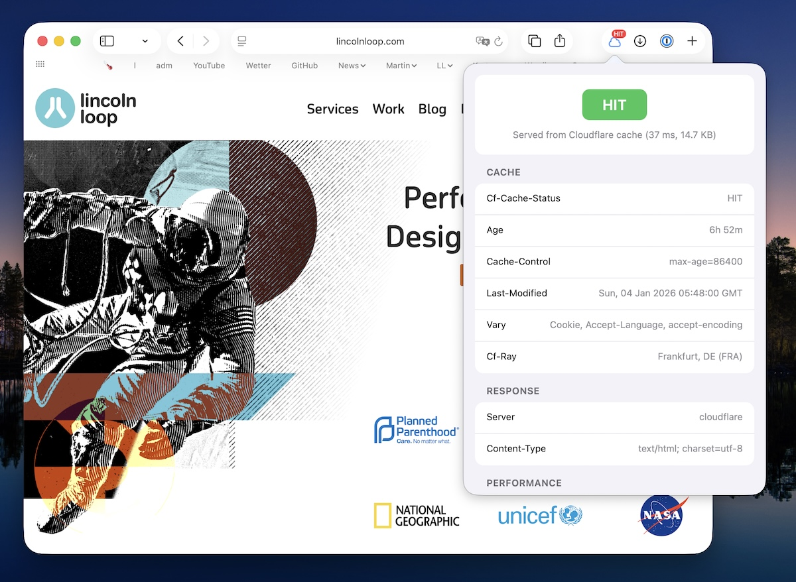

# Cache Status

A Safari extension that displays CDN cache status (HIT/MISS) for the current page with detailed header information.




## Features

- **Toolbar Badge** — Color-coded cache status (HIT/MISS) visible at a glance
- **Detailed Popup** — View all cache-related HTTP headers
- **Edge Location Mapping** — Translates CDN POP codes (e.g., `FRA56`) to city names (e.g., `Frankfurt, DE`)
- **Multi-CDN Support** — Works with Cloudflare, CloudFront, Fastly, Akamai, Bunny CDN, Varnish, and more
- **Dark Mode** — Automatic light/dark theme support

## Supported CDNs

| CDN            | Detection Headers             | Status Header     |
| -------------- | ----------------------------- | ----------------- |
| **Cloudflare** | `cf-cache-status`, `cf-ray`   | `cf-cache-status` |
| **CloudFront** | `x-amz-cf-id`, `x-amz-cf-pop` | `x-cache`         |
| **Fastly**     | `x-served-by`, `x-timer`      | `x-cache`         |
| **Akamai**     | `x-akamai-request-id`         | `x-cache`         |
| **Bunny CDN**  | `cdn-cache`, `cdn-pullzone`   | `cdn-cache`       |
| **Varnish**    | `x-varnish`                   | `x-cache`         |
| **Generic**    | `x-cache`                     | `x-cache`         |

Most CDNs use `x-cache: HIT from...` or `x-cache: MISS from...`, so the generic detection works for many unlisted CDNs as well.

## Cache Status Values

| Status      | Badge  | Color     | Meaning                              |
| ----------- | ------ | --------- | ------------------------------------ |
| HIT         | `HIT`  | 🟢 Green  | Served from CDN cache                |
| MISS        | `MISS` | 🔴 Red    | Fetched from origin server           |
| EXPIRED     | `EXP`  | 🟠 Orange | Cache expired, refetched from origin |
| STALE       | `STL`  | 🟠 Orange | Serving stale content                |
| REVALIDATED | `REV`  | 🟠 Orange | Cache revalidated with origin        |
| REFRESH     | `REF`  | 🟠 Orange | Cache refreshed from origin          |
| BYPASS      | `BYP`  | ⚫ Gray   | Cache bypassed                       |
| DYNAMIC     | `DYN`  | ⚫ Gray   | Dynamic content, not cached          |

## Build & Install

### Prerequisites

- macOS with Xcode installed
- Safari 14+ (for Web Extension support)

### Steps

1. Open the project in Xcode:

   ```bash
   open "CF Cache Status/CF Cache Status.xcodeproj"
   ```

2. Select your development team in **Signing & Capabilities**

3. Build and run (**Cmd+R**)

4. Enable the extension:
   - Open **Safari → Settings → Extensions**
   - Check **Cache Status**

### Development Mode

During development, enable unsigned extensions:

1. Open Safari
2. Go to **Safari → Settings → Advanced**
3. Check **Show Develop menu in menu bar**
4. Go to **Develop → Allow Unsigned Extensions**

> **Note:** This setting resets each time Safari is quit.

### Testing

Run the CDN detection test suite:

```bash
just test
```

### Build Commands

The project uses [Just](https://github.com/casey/just) for build automation:

```bash
just              # List all commands
just build-dev    # Build for development (unsigned)
just build-release # Build release (unsigned, for testing)
just clean        # Clean build artifacts
just xcode        # Open project in Xcode
```

## Release Process

Creating a signed and notarized release requires Apple Developer credentials.

### Prerequisites

1. **Apple Developer Account** with a Developer ID certificate

2. **Create `.env`** in the project root:

   ```bash
   cp .env.example .env
   ```

   Then edit `.env` with your credentials:

   | Variable             | Description                                                                 |
   | -------------------- | --------------------------------------------------------------------------- |
   | `APPLE_ID`           | Your Apple ID email                                                         |
   | `APPLE_TEAM_ID`      | 10-character Team ID from [developer.apple.com/account](https://developer.apple.com/account) → Membership |
   | `APPLE_APP_PASSWORD` | App-specific password from [appleid.apple.com](https://appleid.apple.com/account/manage) → Sign-In and Security → App-Specific Passwords |

3. **Configure Xcode signing** with your Developer ID certificate

### Release Commands

**Full automated release** (archive → submit → wait → staple):

```bash
just release v0.0.5
```

**Step-by-step release** (useful when notarization takes time):

```bash
# 1. Build and sign
just archive v0.0.5

# 2. Submit for notarization
just submit

# 3. Check status (optional)
just status

# 4. Wait for completion (can take minutes to hours)
just wait

# 5. Staple ticket and create final zip
just staple
```

**Other commands:**

```bash
just history      # Show notarization history
just log <id>     # Get notarization log for a submission
just builds       # List available builds
```

### Build Output

Builds are organized by version in `build/<version>/`:

```
build/
├── v0.0.4/
│   ├── archive/CF Cache Status.xcarchive
│   ├── export/CF Cache Status.app
│   ├── CacheStatus-v0.0.4.zip          # Final notarized release
│   └── .submission_id                   # Notarization tracking
└── .current_version                     # Tracks active build
```

## Project Structure

```
CF Cache Status/
├── CF Cache Status/                    # macOS container app (SwiftUI)
│   ├── CacheStatusApp.swift
│   ├── ContentView.swift
│   └── Assets.xcassets/
└── CF Cache Status Extension/          # Safari Web Extension
    ├── content.js                      # Performance metrics collection
    └── Resources/
        ├── manifest.json               # Extension configuration
        ├── constants.js                # Shared CDN detection rules
        ├── background.js               # Header capture & badge updates
        ├── popup.html/js/css           # Popup UI
        └── images/
scripts/                                # Release automation
tests/                                  # CDN detection tests
Justfile                                # Build commands
```

## Permissions

| Permission      | Purpose                          |
| --------------- | -------------------------------- |
| `webRequest`    | Read HTTP response headers       |
| `webNavigation` | Detect page navigations          |
| `activeTab`     | Access current tab information   |
| `<all_urls>`    | Monitor requests to all websites |

## How It Works

1. **Navigation Detection** — When you navigate to a page, `webNavigation.onBeforeNavigate` marks the tab as pending
2. **Header Capture** — `webRequest.onHeadersReceived` captures response headers for the main document only
3. **CDN Detection** — Headers are analyzed to identify the CDN provider
4. **Status Parsing** — Cache status is extracted from CDN-specific headers
5. **Badge Update** — Toolbar badge is updated with color-coded status
6. **Popup Display** — Clicking the icon shows detailed header information

## License

MIT
